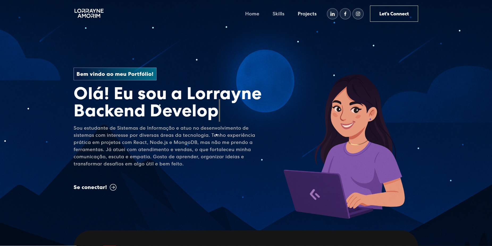

## 💻 Lorrayne Amorim – Personal Portfolio

## ✨ Sobre

Sou estudante de Sistemas de Informação e apaixonada por tecnologia. Desenvolvo soluções com propósito, explorando diferentes áreas do desenvolvimento de software. Este portfólio foi criado para apresentar meus trabalhos, estudos e experiências de forma simples, moderna e acessível.

## 🚀 Tecnologias Utilizadas

- ⚛️ React.js
- ⚡ Vite
- 🎨 CSS3, HTML5
- 💅 React-Bootstrap
- 🔤 React Typed (efeito de digitação)
- 📦 Node.js e MongoDB (em projetos externos)

---
## 📂 Estrutura do Projeto

```bash
src/
├── assets/
│   ├── img/         → Imagens usadas
│   └── font/        → Fontes personalizadas
├── components/      → Componentes reutilizáveis
├── App.js           → Componente principal
├── index.js         → Ponto de entrada
```
## 🌐 Acesse Online

Disponível via GitHub Pages:  
🔗 https://lorrayneamorim.github.io//personal-portfolio

## 📸 Preview



## 🛠️ Como Rodar Localmente

```bash
git clone https://github.com/lorrayneamorim/personal-portfolio.git
cd personal-portfolio
npm install
npm run dev
```

> Se estiver usando CRA: `npm start`

---

## 🤝 Conecte-se Comigo

- [LinkedIn](https://linkedin.com/in/lorrayne-amorim-fernandes-da-cunha-2b9606220)
- [Instagram](https://instagram.com/lorrayneamoriim)
- 📧 lorrayneamorimfc@hotmail.com


Feito com carinho e muitas linhas de código 💚